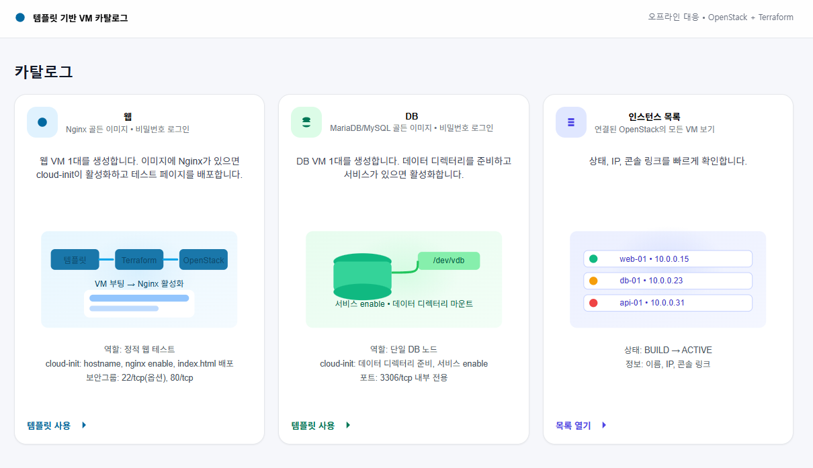
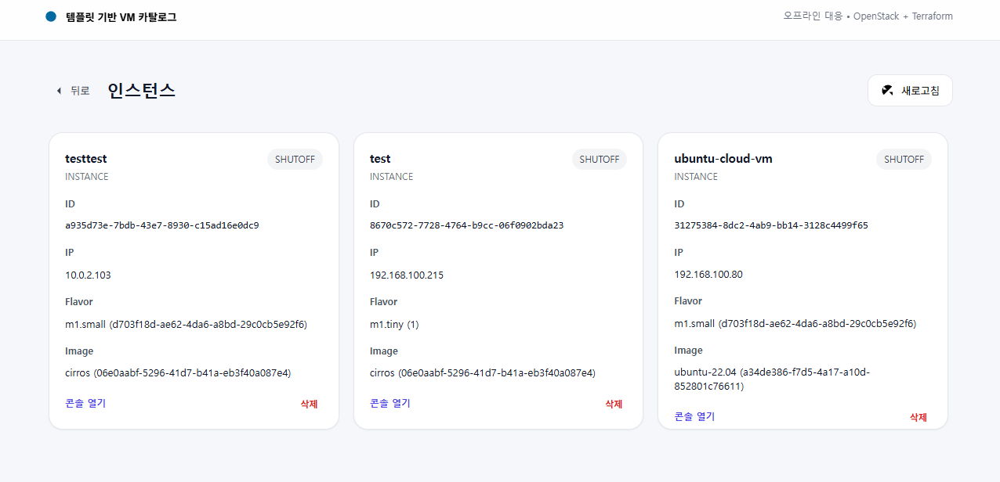

# VMCatalog
**Terraform + OpenStack(openstack4j) 기반 VM 셀프서비스 카탈로그 학습 프로젝트**

Terraform과 openstack4j를 활용하여 
**오프라인(OpenStack 내부망) 환경에서도 즉시 VM을 생성·부팅하고 cloud-init으로 초기 설정을 자동 적용**할 수 있는  
템플릿 기반 VM 카탈로그 웹 애플리케이션입니다.

사용자는 **템플릿(Web / DB)** 을 선택하고 hostname만 입력하면,  
인프라 설정을 직접 작성하지 않아도 VM을 온디맨드로 생성할 수 있습니다.

---

## 화면 미리보기

### 1. 템플릿 기반 VM 카탈로그 화면

- Web / DB 역할별 VM 템플릿 제공
- 각 템플릿은 사전 정의된 리소스 스펙과 cloud-init 설정을 포함
- Terraform → OpenStack 자동 프로비저닝 흐름을 시각적으로 표현

### 2. 인스턴스 목록 화면

- 생성된 VM 인스턴스를 카드 형태로 나열
- 상태, IP, Flavor, Image 등 주요 정보 한눈에 확인
- OpenStack 콘솔 접근 링크 제공

---

## 핵심 개념

### 템플릿(카탈로그 항목)
- VM 역할을 정의하는 사전 설정 단위
- 제공 템플릿
    - **Web**: Nginx 기반 웹 서버
    - **DB**: MariaDB/MySQL 단일 노드
- 각 템플릿은 다음 정보를 포함
    - 기본 리소스 스펙 (Image, Flavor, Network)
    - cloud-init 템플릿 경로

### 주문(Order)
- 사용자가 템플릿을 선택하고 hostname을 입력하면 생성되는 작업 단위
- 주문 1건 = VM 1대 생성
- 주문 단위로 Terraform 작업 디렉터리를 분리하여 관리

---

## 동작 흐름
1) **주문 요청**  
   `POST /api/orders/web` (또는 `/db`)을 호출하면 주문 ID/템플릿/hostname/name을 입력받습니다.
2) **작업 디렉터리 준비**  
   `${APP_WORKDIR}/{orderId}`를 만들고 `infra/terraform` 모듈을 그대로 복사합니다.
3) **템플릿별 기본값/경로 결정**  
   (네트워크/이미지/플레이버, cloud-init 템플릿 경로)
4) **cloud-init 렌더링**  
   템플릿 파일을 읽어 hostname을 치환해 `cloudinit/{web|db}.yaml`로 저장합니다.
    - 저장소에는 `cloudinit-templates/web.yaml`만 있습니다.
    - DB 템플릿을 쓰려면 `cloudinit-templates/db.yaml`(또는 설정된 경로) 파일을 직접 추가해야 합니다.
5) **terraform.tfvars 생성**  
   name, network_id, image_id, flavor_id, user_data(file 경로)을 기록합니다.
6) **Terraform 실행**  
   `terraform init` → `terraform apply -auto-approve`를 수행합니다.
7) **결과 반환**  
   `terraform output -json`을 파싱해 `serverId/serverName/ipInfo` 등을 `OrderResult`로 응답합니다.
8) **삭제** (카탈로그로 생성한 인스턴스만 삭제 가능합니다.)  
   `DELETE /api/orders/{orderId}` → 해당 작업 디렉터리에서 `terraform destroy -auto-approve`.

---

## 필요 환경

### 필수 소프트웨어
- Java 17
- Gradle (wrapper 사용 가능)
- Terraform CLI (PATH 등록)

### OpenStack 인증 정보
다음 환경 변수가 필요합니다.
- `OS_AUTH_URL`
- `OS_USERNAME`
- `OS_PASSWORD`
- `OS_PROJECT_NAME`
- `OS_USER_DOMAIN_NAME`
- `OS_PROJECT_DOMAIN_NAME`
- `OS_REGION_NAME`
- `OS_INTERFACE`

    - `.env.sample`을 참고하여 `.env.secret` 파일을 생성합니다.

### Terraform 변수 파일(tfvars)
Terraform 실행을 위해 역할별 tfvars 파일이 반드시 필요합니다.

다음 파일을 직접 생성해야 합니다.

- `infra/terraform/terraform-web.tfvars`
- `infra/terraform/terraform-db.tfvars`

각 파일은 아래 샘플을 참고하여 작성합니다.

- `infra/terraform/terraform-web.tfvars.sample`
- `infra/terraform/terraform-db.tfvars.sample`

### 애플리케이션 설정
- `APP_WORKDIR`
    - 주문별 Terraform 작업 디렉터리 루트
- `APP_TF_MODULE_DIR`
    - 기본값: `infra/terraform`

---

## 실행 방법

- .env.sample 참고하여 .env.secret 작성
- `infra/terraform/terraform-{web|db}.tfvars.sample`을 참고하여  
  아래 실제 변수 파일을 생성합니다. (Terraform 실행 시 사용)
    - `infra/terraform/terraform-web.tfvars`
    - `infra/terraform/terraform-db.tfvars`
- Spring Boot 애플리케이션 실행
- 웹 페이지에서 템플릿 선택 → 주문 생성
- VM 생성 상태 및 콘솔 확인
